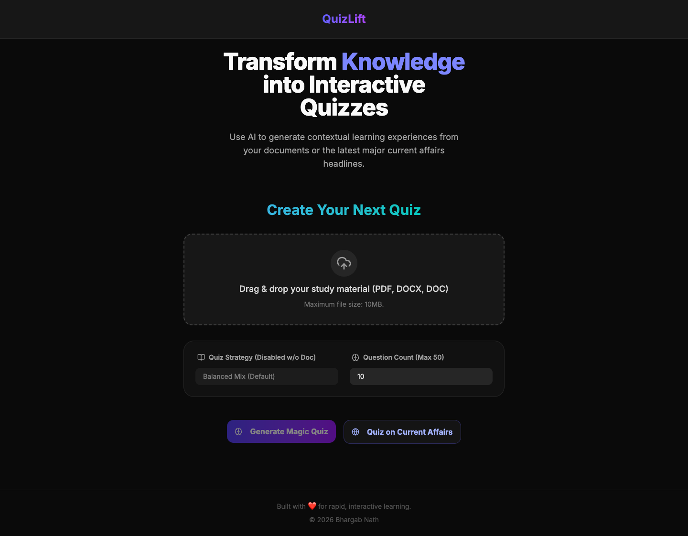
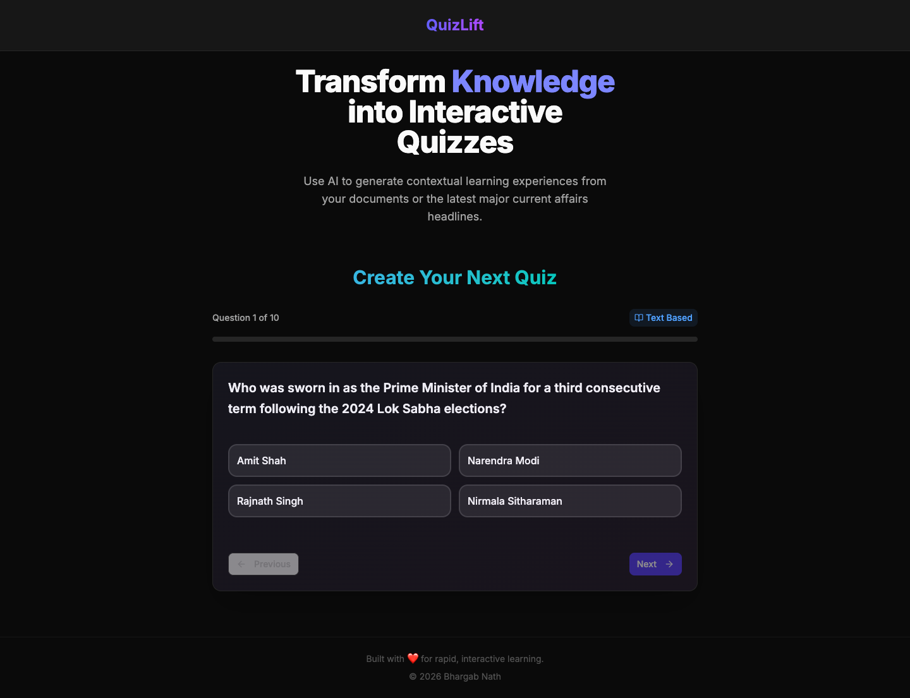

# QuizLift: Intelligent Document Comprehension & Contextual Assessment

**QuizLift** is a high-performance AI educational platform. It offers two distinct pathways for active recall:
1. **Document Comprehension**: Transform static reading materials (PDF, DOCX, DOC) into dynamic, multi-modal assessment modules. 
2. **Current Affairs Mastery**: Generate instant, context-rich quizzes based on major national and international headlines, optimized specifically for government and civil service exams without needing any uploaded materials.




## 🧠 Advanced AI Logic: Beyond Simple Extraction
Unlike standard Q&A systems, QuizLift utilizes a dual-engine questioning strategy powered by **Google Gemini 1.5/2.5**:

*   **Direct Semantic Mapping:** Challenges the user with questions directly derived from the document's explicit text for foundational verification.
*   **Conceptual "In & Around" Logic:** Synthesizes the document's core themes to generate questions about related concepts and logical extensions, ensuring a deep conceptual grasp rather than mere rote memorization.




## ✨ Core Features
1.  **Seamless Document Ingestion:** Instantly process dense reading materials, lecture slides, or technical documentation (PDF, DOCX, DOC) via a drag-and-drop interface.
2.  **Current Affairs / Gov Exam Mode:** Generate highly-relevant questions on Economics, International Relations, National News, and Science & Tech straight from the latest headlines, perfectly suited for government exam preparation.
3.  **Context-Aware MCQ Generation:** High-fidelity parsing ensures all generated questions are strictly relevant to the uploaded content with "In & Around" contextual logic.
4.  **Real-Time Feedback Loop:** Interactive UI provides immediate validation and detailed explanations for every answer choice.
5.  **Premium Experience:** A sleek, dark-mode interface built with modern web aesthetics for a focused, distraction-free learning environment.

## 🛠 Technology Stack
*   **Frontend:** Next.js (App Router), React, Tailwind CSS, Framer Motion, Shadcn UI
*   **Backend:** Python FastAPI (Optimized for Vercel Serverless Functions)
*   **AI Orchestration:** Google Gemini Pro / Flash 
*   **Styling:** Modern Dark-mode Glassmorphism

---

## 🚀 Local Development Setup

### 1. Prerequisites
*   **Node.js** (v18 or higher)
*   **Python** (3.12 or higher)
*   **Google AI Studio API Key** (for Gemini)

### 2. Environment Configuration
Create a `.env` file in the appropriate directory (or set globally) with your API key:
```bash
GEMINI_API_KEY=your_gemini_api_key_here
```

### 3. Backend Execution (FastAPI)
```bash
cd backend
python3 -m venv venv
source venv/bin/activate
pip install -r requirements.txt
uvicorn main:app --port 8000 --reload
```
*Backend runs on `http://localhost:8000`*

### 4. Frontend Execution (Next.js)
```bash
cd frontend
npm install
npm run dev
```
*Frontend accessible at `http://localhost:3000`*

## 📝 Disclaimer
QuizLift is an AI-driven tool for educational assistance. While it strives for high accuracy in question generation, users are encouraged to verify critical information against the original source text.
